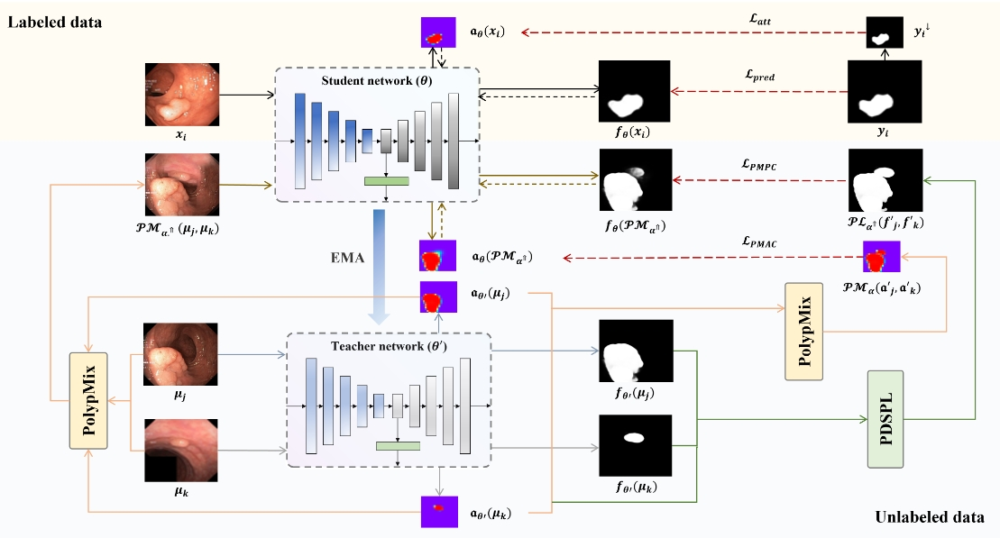

# PolypMix

This repo is the official implementation
of ["PolypMixNet: Enhancing semi-supervised polyp segmentation with polyp-aware augmentation"](https://www.sciencedirect.com/science/article/pii/S0010482524000908)
by Xiao Jia, et al.

## Introduction



In this paper, we present a novel polyp-aware augmentation-based semi-supervised framework, PolypMixNet,
with dual-level consistency regularization for polyp segmentation
when there is limited annotated data but sufficient unlabeled data available.

Our key idea of PolypMix is to mix two unlabeled images by sampling more on polyp-like pixels and less on
background-like pixels based on network predictions.

## Running

### Environment

|  name   |         version         |
|:-------:|:-----------------------:|
|   GPU   | NVIDIA GeForce RTX 3090 |
| System  |      Ubuntu 20.04       |
| Python  |         3.8.18          |
| Pytorch |          2.0.1          |

### Data

The dataset should be organized as:

```
dataset_root
├─ kvasir_SEG
│  ├── Train
│  │   ├── images
│  │   └── masks
│  ├── Valid
│  │   ├── images
│  │   └── masks
│  └── Test
│      ├── images
│      └── masks
├─ CVC_300
│  ├── ...
├─ CVC_ClinicDB
│  ├── ...
├─ ...
```

There are same file names in `images` and `masks` folders.

### Training

**Train kvasir_SEG + PolypMix + GPU0 + use 90 labeled samples + shuffle dataset:**

```shell
python train_model.py --root <PATH_TO_DATASET_ROOT> --checkpoints <PATH_TO_CHECKPOINTS> --gpu_id 0 --dataset kvasir_SEG --method PolypMix --label_mode number --labeled_num 90 --shuffle True --suffix number --expID 8888
```

**Train kvasir_SEG + PolypMix + GPU0 + use 15 percentage labeled samples + shuffle dataset:**

```shell
python train_model.py --root <PATH_TO_DATASET_ROOT> --checkpoints <PATH_TO_CHECKPOINTS> --gpu_id 0 --dataset kvasir_SEG --method PolypMix --label_mode percentage --labeled_perc 15 --shuffle True --suffix percentage --expID 8888
```

Addition, if you want to use cpu training model, just add `--use_gpu False`

### Testing

**Test kvasir_SEG dataset:**

```shell
python test_model.py --root <PATH_TO_DATASET_ROOT> --checkpoints <PATH_TO_CHECKPOINTS> --dataset kvasir_SEG  --suffix number
```

Then, you will find predict ground truth images in a folder (e.g. `kvasir_SEG_number/002_GroundTruth/exp8888`).
And, you will find evaluation in a text file (e.g. `kvasir_SEG_number/003_Evaluation/kvasir_SEG_eval_exp8888.txt`).

**Test CVC_300 with pretrained model based on kvasir_SEG:**

```shell
python test_model.py --root <PATH_TO_DATASET_ROOT> --checkpoints <PATH_TO_CHECKPOINTS> --dataset CVC_300 --select_checkpoint kvasir_SEG_percentage --suffix direct
```

`kvasir_SEG_percentage` is a folder in checkpoint folder, which is trained by kvasir_SEG dataset.

# Reference Code

|   Name   |                   Link                    |
|:--------:|:-----------------------------------------:|
|    MT    | https://github.com/CuriousAI/mean-teacher |
|   UAMT   |     https://github.com/yulequan/UA-MT     |
|   ICT    |   https://github.com/vikasverma1077/ICT   |
|  ADVENT  |     https://github.com/valeoai/ADVENT     |
| ClassMix |   https://github.com/WilhelmT/ClassMix    |
|   URPC   |   https://github.com/HiLab-git/SSL4MIS    |

Thanks for their work again.

## Cite PolypMix

If you find this repository useful, please use the following BibTeX entry for citation.

```latex
@article{jia2024polypmixnet,
  title = {{{PolypMixNet}}: {{Enhancing}} Semi-Supervised Polyp Segmentation with Polyp-Aware Augmentation},
  author = {Jia, Xiao and Shen, Yutian and Yang, Jianhong and Song, Ran and Zhang, Wei and Meng, Max Q. -H. and Liao, Joseph C. and Xing, Lei},
  year = {2024},
  journal = {Computers in Biology and Medicine},
  pages = {108006},
  doi = {10.1016/j.compbiomed.2024.108006}
}
```

## License

This project is released under the MIT license. Please see the [LICENSE](LICENSE) file for more information.